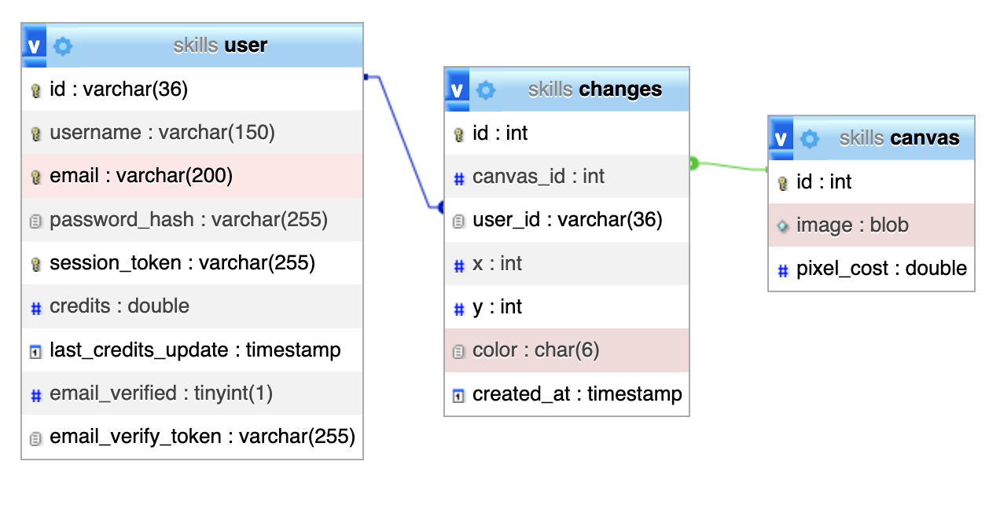
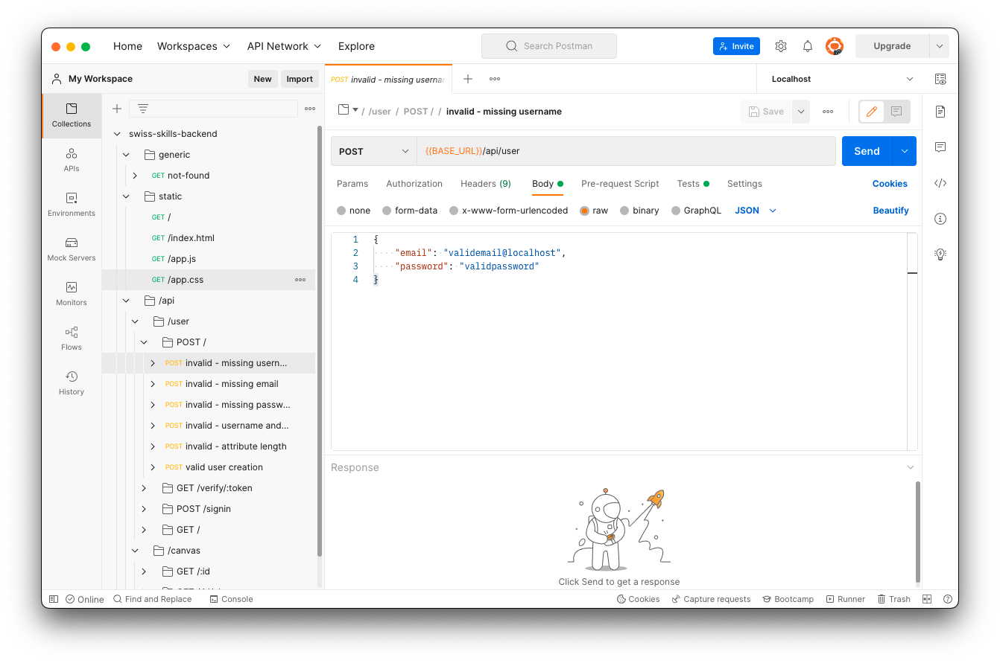
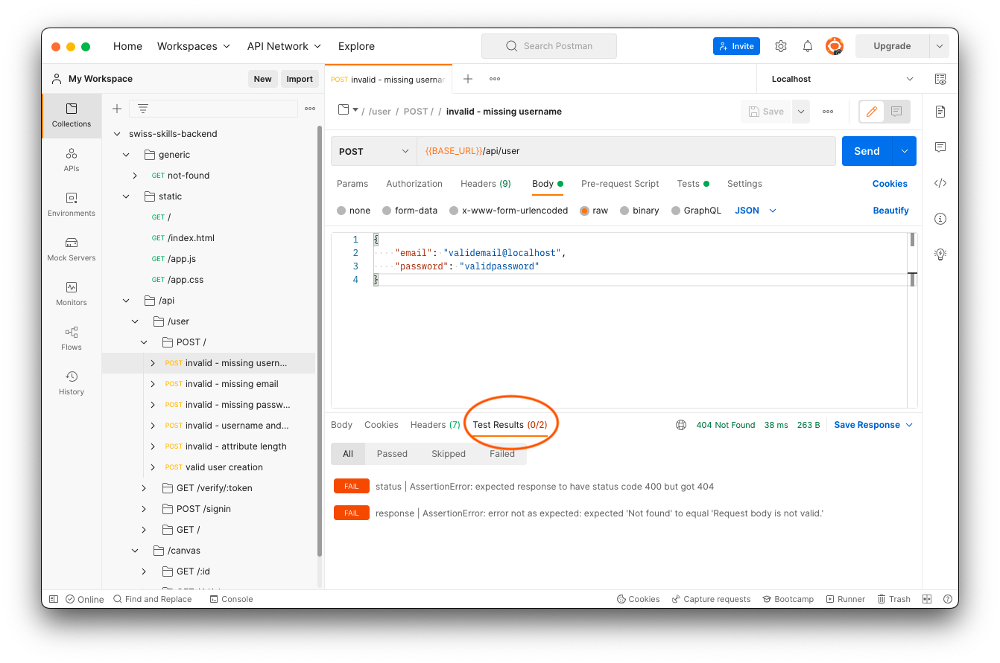
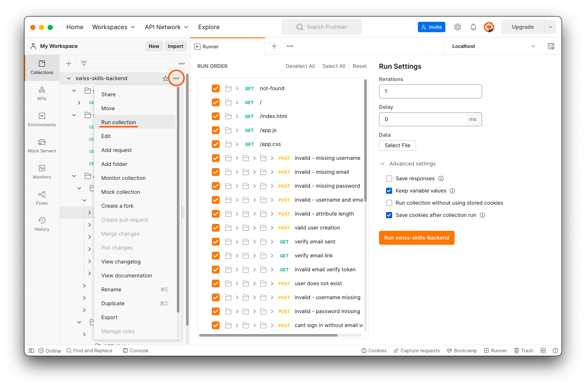

import {Highlight} from '@skills17/competitor-readme';

# Task - Pixel Canvas API

Your task is to create a REST API that can be consumed by an existing frontend to collaboratively draw on a canvas.
[Reddit's /r/place](https://www.reddit.com/r/place/) served as inspiration. You do not need to be familiar with it to
solve this task.

## Table of Contents

- [Introduction](#introduction)
- [Database](#database)
- [Auth](#auth)
- [Email](#email)
- [Tests](#tests)
- [Development Environment](#development-environment)
- [Static Assets](#static-assets)
- [API](#api)
- [Postman Guide](#postman-guide)

## Introduction

A user can register, login, and draw pixels. Anonymous users can view the drawn canvas and receive near-realtime
updates of changed pixels.


The canvas is a 10x10 grid of pixels. Each pixel can a have an RGB hex color value. The color value is represented as a
string in the format `"RRGGBB"`. For example red is `"ff0000"`.

Each pixel's color can be changed by logged-in users. They click on the pixels and select a new color. Once happy, they
can submit the changed pixels to the server. Changing pixels uses up the user's credits. Registered users are
automatically collecting credits over time. In this task it will be 5 credits per minute.

Your task is to implement the backend API. A crude frontend application and a database have already been setup.

## Database

The database with the name `skills` has been prepared for you with a structure and data. A database dump is also provided to you in `work/backend/dump.sql`.
You can use the dump to reset your database to the original state, should your database get damaged.

The dump creates tables and foreign key constraints and fills in 3 rows in the `canvas` table and creates a `testaccount`
user in the `user` table.


The tests assert that the original canvases in the dump exist in the database.
If you happen to delete or modify them, you need to reset your database manually, to make the tests able to pass.

PHPMyAdmin is available at [http://localhost/phpmyadmin](http://localhost/phpmyadmin), and you should be automatically
logged in. In case this does not work, or you were logged out, the username is "root" and the password is "" (empty password).

### Schema



Please check these descriptions to learn more about the table columns.

**Table `canvas`**

| Column     | Type   | Description                       |
|------------|--------|-----------------------------------|
| id         | int    | PK                                |
| image      | blob   | A string encoded with RGB colors. |
| pixel_cost | double | The cost to draw per pixel        |


<br/>

**Table `user`**

| Column              | Type         | Description                                                                               |
|---------------------|--------------|-------------------------------------------------------------------------------------------|
| id                  | varchar(36)  | PK as UUID                                                                                |
| username            | varchar(150) | Unique username chosen by user during sign-up                                             |
| email               | varchar(200) | Email address of the user                                                                 |
| password_hash       | varchar(255) | Salt and password hash of the user.                                                       |
| session_token       | varchar(255) | Token to identify the user session.                                                       |
| credits             | double       | Precise amount of credits available of the user when it was last updated. Has to be `>=0` |
| last_credits_update | timestamp    | The last time the `credits` column was updated. *                                         |
| email_verified      | tinyint(1)   | 1 if the email was verified. 0 if not yet.                                                |
| email_verify_token  | varchar(255) | The token sent as part of a link to the user's email address.                             |

\* The current credit amount of a user can be determined by first taking their `credits` and then adding the number of
minutes passed since `last_credits_update` and now and multiply that by `5`.


<br/>

**Table `changes`**

| Column     | Type        | Description                          |
|------------|-------------|--------------------------------------|
| id         | int         | PK                                   |
| canvas_id  | int         | FK of `canvas.id`                    |
| user_id    | varchar(36) | FK of `user.id`                      |
| x          | int         | x coordinate of change               |
| y          | int         | y coordinate of change               |
| color      | char(6)     | new color in RGB Hex (e.g. `FF00FF`) |
| created_at | timestamp   | Time of change creation              |


## Auth

The users of this application can sign-up (register) and sign-in (login). Thus, there are some endpoints that are
only accessible to authenticated users. The authentication checks you have to build is to check an HTTP header
`X-SESSION-ID` against a locally kept session store.

When the user signs in, you can store a newly generated token in the column `session_token` in the database.

Please note that the database already contains a user with a stored session token. That token will be used in some tests
in Postman, so you are required to read from that column.

## Email

The users registering for Pixel Canvas need to verify their email address before they can sign-in. In our setup, we will
use [Mailhog](https://github.com/mailhog/MailHog) as a fake email (SMTP) server. It has already been set up for you.

To send emails to Mailhog, you can use the code provided to you.

You can see the emails you have sent on this URL: [http://localhost:8025](http://localhost:8025).

The tests will use the Mailhog API, to see if the required email was actually sent. I.e. [http://localhost:8025/api/v2/search?kind=containing&query=Welcome](http://localhost:8025/api/v2/search?kind=containing&query=Welcome).

## Tests

To evaluate the API, you have been provided with a Postman collection. First, ensure your application is running.
You have two ways to execute the tests:

- Postman (visually): Open Postman (in the dock on the left side), you should see the collection already imported.
- We have prepared some detailed instructions at the bottom of the page in case you are not very familiar with Postman: [Postman Guide](#postman-guide).
- Newman (command line): Run the tests with `npm test` to see a command line output. This command will also show you how many points you will be awarded.
The points are not visible in the Postman UI.

<Highlight type="warning">
    There is an extra collection, not available for you, that will also be used to evaluate your solution that contains
    the exact same tests, but different values in the URLs and expected responses. So, do not catch specific values or
    return hard-coded responses, as this will fail later.
</Highlight>

Making all tests pass is hard. Please be aware that this is not an exam where you get a grade. This is a competition where
you are ranked among each other.

## Development Environment

You have been provided with boilerplate code to start coding. There are two setups:

- Node.JS with Express.js in `work/backend/src-node`.
  - You can start the server by running `npm start` within `work/backend`.
  - Your code changes are automatically applied. You do not need to restart the development server.
  - Console outputs are logged into the **terminal window** where you run `npm start`.
- PHP in `work/backend/src-php`.
  - You can start the development server by running `composer start` within `work/backend`.
  - Your code changes are automatically applied. You do not need to restart the development server.
  - PHP warnings, errors, and exceptions are logged into the **terminal window** where you run `composer start`.

<Highlight type="warning">
    You can choose freely between those two and are only expected to solve it in one stack. Should you switch over
    mid-way, the final solution that gets more points will be the one that is taken into account. Points cannot be
    accumulated from both of the two solutions.
</Highlight>

<Highlight type="error">
    You can only change files under `work/backend/src-node/` or `work/backend/src-php/`.
    All other files and the database will be reverted for the review process.
</Highlight>

## Static Assets

The frontend application is provided at `work/backend/static`. Your server application should return these files under
the following URLs with status code 200 and respective content type:

- `/`: `work/backend/static/index.html`
- `/index.html`: `work/backend/static/index.html`
- `/app.css`: `work/backend/static/app.css`
- `/app.js`: `work/backend/static/app.js`

## API

**General information:**

- The response bodies contain some static example data. Dynamic data from the database should be used.
- The order of properties in objects does not matter.
- The `Content-Type` header of a request must always be `application/json` for `POST`, `PUT`, `PATCH`.
- The `Content-Type` header of a response is always `application/json` unless specified otherwise.
- Timestamps are formatted as ISO-8601 strings. E.g. `2032-01-31T21:59:35.000Z`.

### `POST /api/user`

This endpoint creates a new user and sends an email with a link to verify the email address.

**Email**:

The email is sent to the user's email address and must have this subject and content:

Subject: `Welcome to Pixel Canvas {{username}}`

Content:
```
<strong>Welcome to Pixel Canvas</strong>
<br/>
<br/>
<p>
    Please verify your email address by clicking on the following link:
</p>
<p>
    <a href="{{verifyUrl}}">{{verifyUrl}}</a>
</p>
```

The `verifyUrl` is a generated link by the backend with a random token to `GET /api/user/verify/:token`.
Example: `http://localhost:4000/api/user/verify/b3b8038e-7651-4e98-9503-51a1b68ed0c2`

**Request Body**:

```json
{
    "username": "testuser",
    "email": "skills@localhost",
    "password": "asdf1234"
}
```

| Property     | Comment                                                                              |
|--------------|--------------------------------------------------------------------------------------|
| username     | required, min length 4, max length 150                                               |
| email        | required, max length 200                                                             |
| password     | required, min length 8, max length 2^16                                              |

**Response**:

#### Successful creation response:

Status Code: 201

Response Body:
```json
{
    "message": "Welcome to Pixel Canvas! We sent you an email to verify your email address."
}
```

#### Invalid request body

Status Code: 400

Response Body:
```json
{
    "error": "Request body is not valid.",
    "invalid": true,
    "violations": {
        "username": {
            "message": "Attribute is required"
        },
        "email": {
            "message": "Attribute must be at most 200 characters long."
        },
        "password": {
            "message": "Attribute must be at least 8 characters long."
        }
    }
}
```

In the above example, all possible violations are shown. The actual returned violations should only be the fields which were actually invalid.
At most one validation per field is shown.

### `GET /api/user/verify/:token`

This checks the token against a known user. If found, sets the user's email verified to true and redirects to `/` using 301.

#### Found response:

Status Code: 302
Header: `Location: /`

#### Not Found response:

Status Code: 401

Response Body in plain text (no JSON):
```
Invalid token
```


### `POST /api/user/signin`

This endpoint signs in a user and returns a session ID.

**Request Body**:

```json
{
    "username": "testuser",
    "password": "asdf1234"
}
```

#### Successful response:

Status Code: 200

Response body:
```json
{
    "sessionId": "928d7453-ed3f-4214-a517-9d68274170f0"
}
```


#### User does not exist, or password wrong:

Status Code: 401

Response Body:
```json
{
    "error": "User does not exist"
}
```

#### User email not verified:

Status Code: 401

Response Body:
```json
{
    "error": "User email not verified. Please click on the link in the email we sent you."
}
```

### `GET /api/user`

This returns the current amount of credits for the user in the session.
The credits need to be computed by the backend. The user gains 5 credits per minute.

**Request Headers**:

- `X-SESSION-ID`: filled with the session token from the sign-in.

#### Successful response:

Status Code: 200

Response Body:
```json
{
    "username": "user-0fc37b33-cd20-4515-b168-7d8fcbc6451c",
    "credits": 0
}
```

#### Missing header:

Status Code: 401

Response Body:
```json
{
    "error": "Session header not found. Please specify the header x-session-id."
}
```

#### Session not found:

Status Code: 401

Response Body:
```json
{
    "error": "Session {{sessionId}} invalid."
}
```


### `GET /api/canvas/:id`

This returns the canvas with the given ID. The image is returned as a continuous string of RGB hex colors.

A 2x2 example with black `000000` and white `ffffff`.
The image string contains the colors left to right, top to bottom:

```
Image:
| 000000 | ffffff |
| ffffff | 000000 |

Encoded:
          000000ffffffffffff000000
          ^     ^     ^     ^
         /     /      |     \
        /      |      |      |
       /       |      |      |
topleft  topright bottomleft bottomright
````

It also returns the pixel cost for the respective canvas.

**Request Body**:

```json
{
    "image": "ff...ff",
    "pixelCost": 5
}
```

#### Non-existing canvas:

Status Code: 404

Response Body:
```json
{
    "error": "Canvas not found"
}
```

### `GET /api/canvas/:id/changes`

Returns the changes to the canvas since a given timestamp.


**Query Parameters**:

| Property | Comment                           |
|----------|-----------------------------------|
| since    | required, must be ISO-8601 string |


#### Successful response:

Status Code: 200

Response Body:
```json
{
    "changes": [{"x": 0, "y": 0, "color": "ff0000"}],
    "pixelCost": 5
}
```

#### Non-existing canvas:

Status Code: 404

Response Body:
```json
{
    "error": "Canvas not found"
}
```

#### Missing "since" parameter:

Status Code: 400

Response Body:
```json
{
    "error": "Missing \"since\" parameter"
}
```

### `PUT /api/canvas/:id`

Checks if the user has enough credits. If yes, records canvas changes and updates the full canvas image returned in
`GET /api/canvas/:id`.

**Request Body**:

```json
{
    "pixels": [
        {"x": 0, "y": 0, "color": "ff0000"}
    ]
}
```

#### Successful response:

Status Code: 200

Response body:
```json
{
    "success": true,
    "creditscreditsDeducted": 5,
    "creditsLeft": 3
}
```


#### Missing header:

Status Code: 401

Response Body:
```json
{
    "error": "Session header not found. Please specify the header x-session-id."
}
```

#### Missing pixels attribute:

Status Code: 400

Response Body:
```json
{
    "error": "Request body is not valid.",
    "invalid": true,
    "violations": {
        "pixels": {
            "message": "Attribute is required"
        }
    }
}
```

#### Non-existing canvas:

Status Code: 404

Response Body:
```json
{
    "error": "Canvas not found"
}
```

#### Pixels attribute is empty

Status Code: 400

Response Body:
```json
{
    "error": "No pixels to draw specified"
}
```

#### Pixels invalid or duplicate

Status Code: 400

Response Body:
```json
{
    "error": "Invalid pixel"
}
```

#### Not enough credits

Status Code: 403

Response Body:
```json
{
    "error": "Not enough credits. Needed: 15. You have: 6"
}
```


### Non-existing API path

If the consumer makes a call to a non-existing path, this must be the response:

Status Code: 404

Response Body:
```json
{
    "error": "Not found"
}
```

---

## Postman Guide

Postman is a graphical tool that allows you to test your API. In Postman you can create requests and organize them
in a collection. We have created a testing collection for you. When you open Postman, you should see this collection
already imported.

[](/api/images/backend/backend/readme-assets/postman-request.png)

If the collection is not there, you can import the collection from the `work/backend/collections/` folder into Postman.
To import, open Postman, click on File and then "Import" to select the collection.

In the screenshot above, you can see that the URL says `{{BASE_URL}}`.
This is an environment variable in Postman that is already set to the correct value for you: `http://localhost:4000`.

Requests are visible on the left side of the screen. They have icons such as `GET`, `POST`, `PUT`.
Under many requests, you can also see an example response with an `e.g.` icon.
This shows you the response that would be expected.

After sending a request, you will see if the tests were successful in the "Test Results" tab like this:

[](/api/images/backend/backend/readme-assets/postman-request-tests.png)

Clicking on the tab reveals more detailed test results.

You can also run all requests at once, which is recommended. To do that, click on the context menu icon of the collection,
and click on "Run collection". This will open the following view:

[](/api/images/backend/backend/readme-assets/postman-run-all.png)

Your goal is to make more tests pass than your fellow competitors can manage to :wink:.
