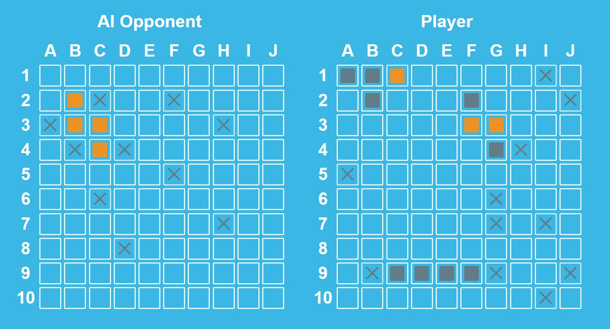

import { Highlight } from '@skills17/competitor-readme';

# Task - Battleship game

Your task is to create a game of battleship against an AI opponent.

## Working directory

You will work in the `src` directory. Follow the implementation instructions in the JSDoc of the class files. Feel free to extend the classes with your own methods or properties if needed.

You may only change the following files:

-   [util.js](http://localhost/work/frontend/src/util.js)
-   [grid.js](http://localhost/work/frontend/src/grid.js)
-   [player.js](http://localhost/work/frontend/src/player.js)
-   [ai-player.js](http://localhost/work/frontend/src/ai-player.js)
-   [game-state.js](http://localhost/work/frontend/src/game-state.js)

**It is recommended to implement the functionality in the above order, starting with `util.js`.**

<Highlight type="error">
  You are not allowed to modify any files outside
  of `work/frontend/src/` in any way
</Highlight>

## Lib

You are given the [`ShipGenerator`](http://localhost/work/frontend/lib/ship-generator.js) class, along with some [error-types](http://localhost/work/frontend/lib/errors.js), which you can use.

<Highlight type="warning">
  You should not change the implementation of these classes as it may impact testing.
  You should always use the provided error-types when throwing errors.
</Highlight>

The `main.js` sets up and starts the game.

**You should not change this file as it may impacts testing.**

## HTML/CSS

You are given the HTML and CSS. Changing any of it is not necessary.

You are however required to create and append some HTML elements in the `grid.js` class.

The game is available and can be played with the [index.html](http://localhost/work/frontend/index.html)
once the functionality has been implemented.

## Scoring

For scoring, we will use automated End-to-End tests to verify that the functionality works as expected.
You can also run the same tests that we will use to verify your score.

To run the tests, open a terminal and `cd` into the `work/frontend` directory.
Then, execute the following command in your terminal:

- `npm run start`
- wait for cypress to start (it might take a bit of time initially)
- select the desired `{component}.test.js`-testsuite
- a chrome window will open and the tests will run
- click the "Run all tests"-Button or reload the page to rerun the test
- select or hover over a test or assertion in the left sidebar to see the HTML at that specific point in time
